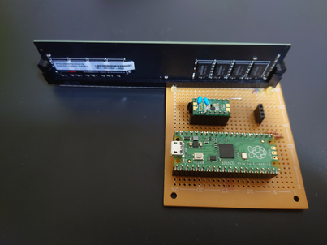
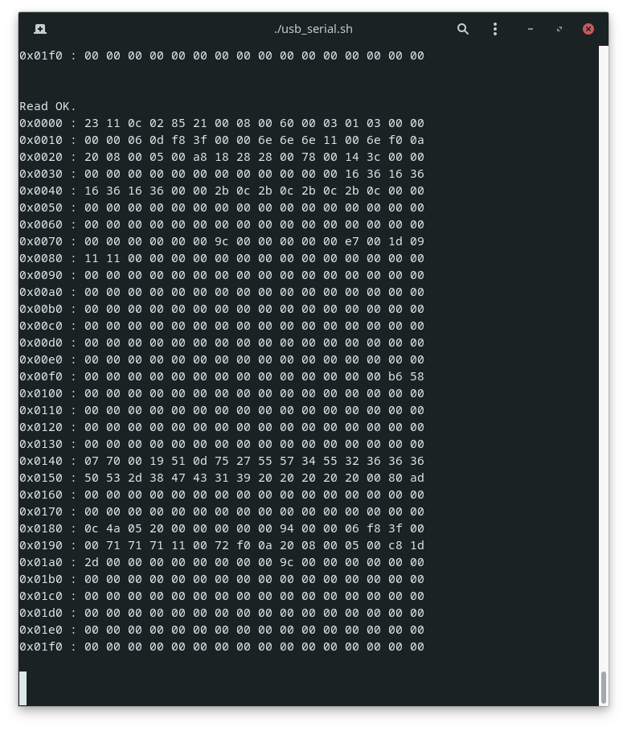

# SPD_RW - DDR4 SPD Reader/Writer



## Quick? start
### 1. Build a borad.
[Link](board/README.md)

### 2. Install Pico-SDK

### 3. Clone this project
```
$ clone https://github.com/kitune-san/SPD_RW.git
$ cd SPD_RW
```

### 4. Copy "pico_sdk_import.cmake" to project root
```
$ cp ${PICO_SDK_PATH}/external/pico_sdk_import.cmake .
```

### 5. Build
```
$ mkdir Build
$ cd Build
$ cmake ..
$ make
```

### 6 Copy build/examples/read_spd/read_spd.uf2 to raspberry pi pico

### 7 Run & Open minicom
```
$ minicom -b 115200 -o -D /dev/ttyACM0
```

