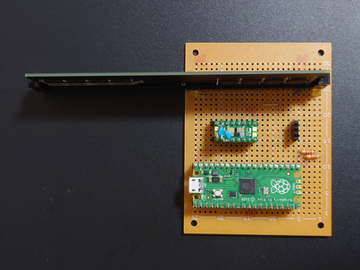
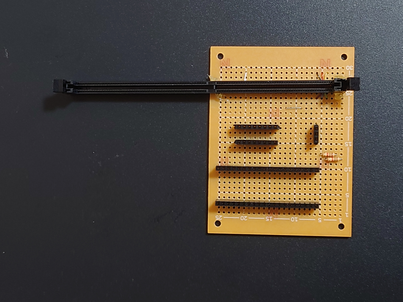
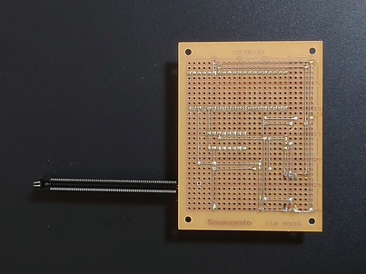
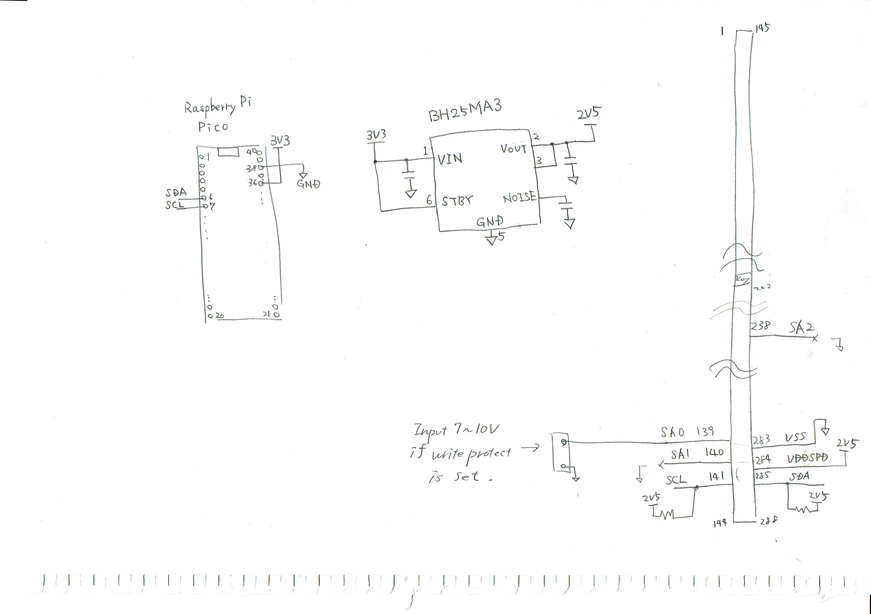

# SPD_RW board

## Component
- Universal circuit board (ex ICB-M93S)
- Raspberry pi pico
- 2.5V Regulator (ex BH25MA3) or 2.5V Zener diode
- DDR4 DIMM 288 PIN SMT TYPE
- Tinned wire
- ETFE wire
- Pin header sockets
- Capacitors
- Resistances

## Schematic

